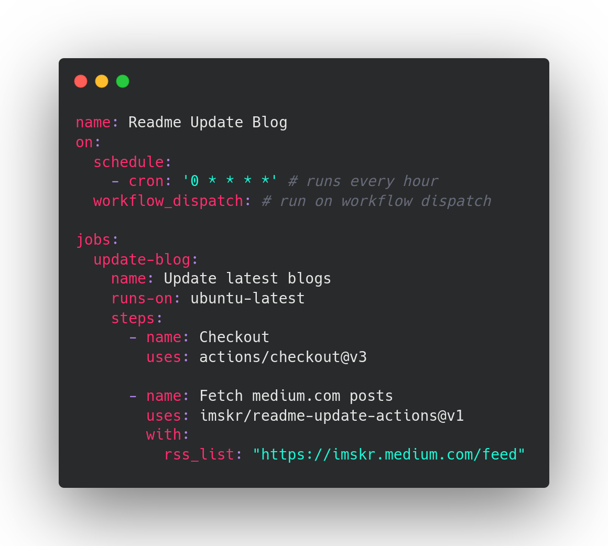
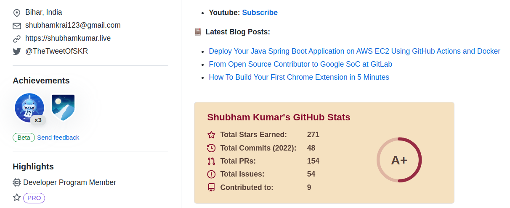

> A Powerful Bot to Update GitHub Profile's Readme using GitHub Actions

<p align="center">
    <br>
    <a href="https://github.com/imskr/readme-update-actions/releases"></a>
    <a href="https://github.com/imskr/readme-update-actions/actions/workflows/build.yml"></a>
    <a href="https://github.com/imskr/readme-update-actions/issues"></a>
</p>
<hr noshade>

## Usage

1. Go to your repository
2. Add the following to your **README.md** file, you can use any title. Just make sure that you use `<!-- BLOG-LIST-START --><!-- BLOG-LIST-END -->` in your readme. The workflow will replace this comment with the actual blog posts list:

    ```markdown
    # Blog posts
    <!-- BLOG-LIST-START -->
    <!-- BLOG-LIST-END -->
    ```

3. Create a folder `.github/workflows` inside root of the repository if it doesn't exists.
4. Create a new file `readme-update-actions.yml`  inside `.github/workflows/`  with the following contents:



5. Replace the above URL list with your own RSS feed URLs.
6. Commit and wait for it to run automatically, or you can also trigger it manually to see the result instantly.

## Results


<!-- BLOG-LIST-START -->
- [Deploy Your Java Spring Boot Application on AWS EC2 Using GitHub Actions and Docker](https://betterprogramming.pub/deploy-your-spring-boot-java-application-to-aws-ec2-using-github-actions-and-docker-e28c456a4b1a?source=rss-2612c96405e4------2)

- [From Open Source Contributor to Google SoC at GitLab](https://medium.com/geekculture/gitlab-google-summer-of-code-e5e819547ee7?source=rss-2612c96405e4------2)

- [How To Build Your First Chrome Extension in 5 Minutes](https://medium.com/dailyjs/how-to-build-your-first-chrome-extension-in-5-min-1dbe3eb94575?source=rss-2612c96405e4------2)
<!-- BLOG-LIST-END -->

## Support

<p>
    <a href="https://buymeacoffee.com/imskr" target="_blank"></a>
</p>
